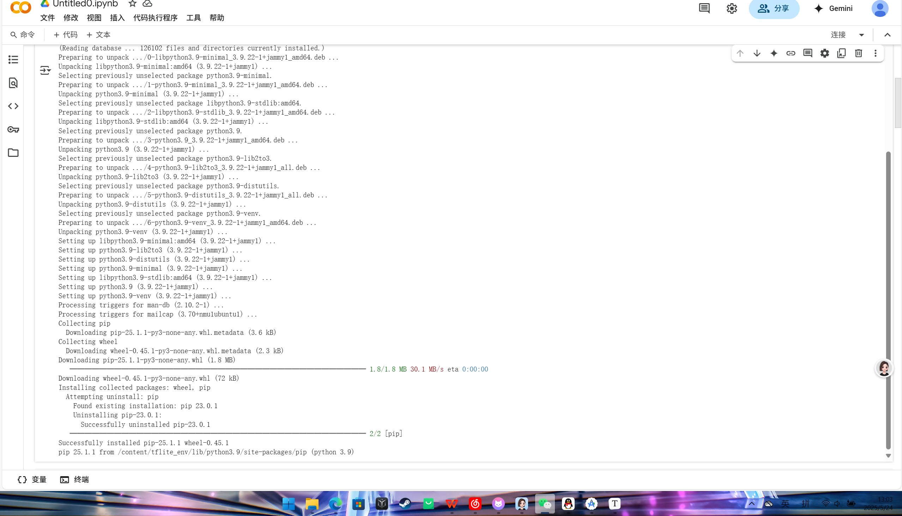
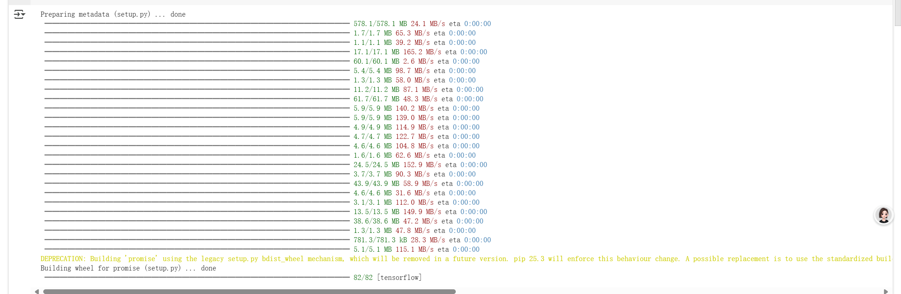
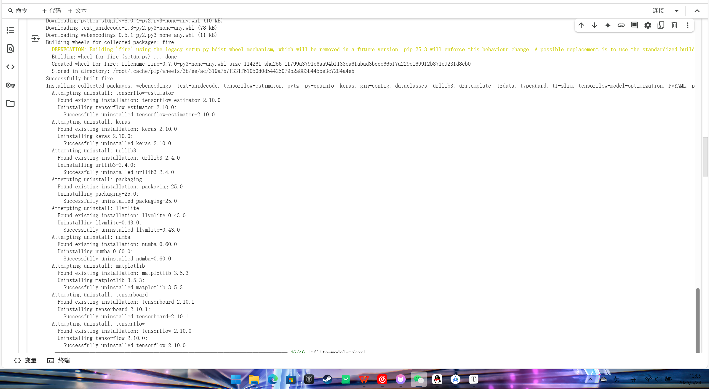
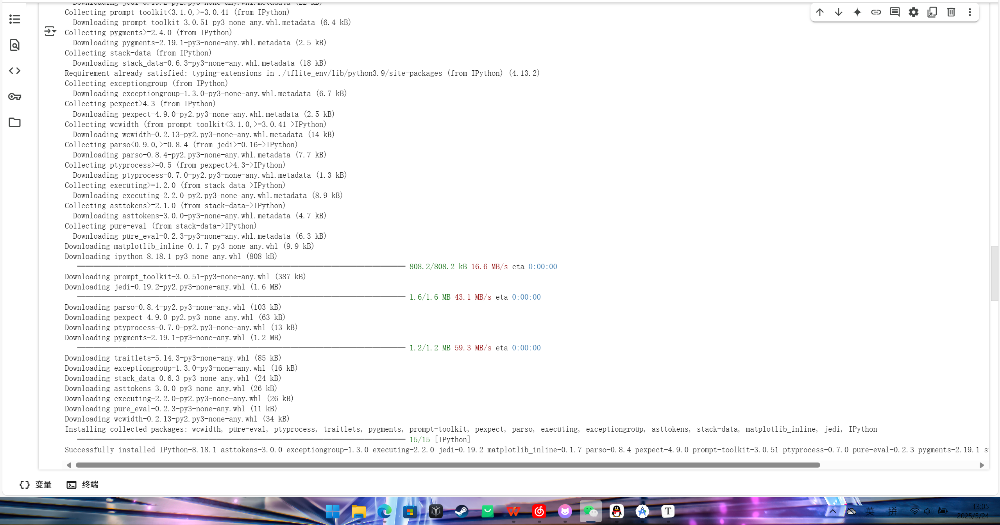
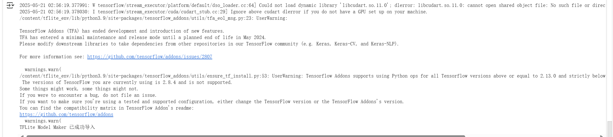
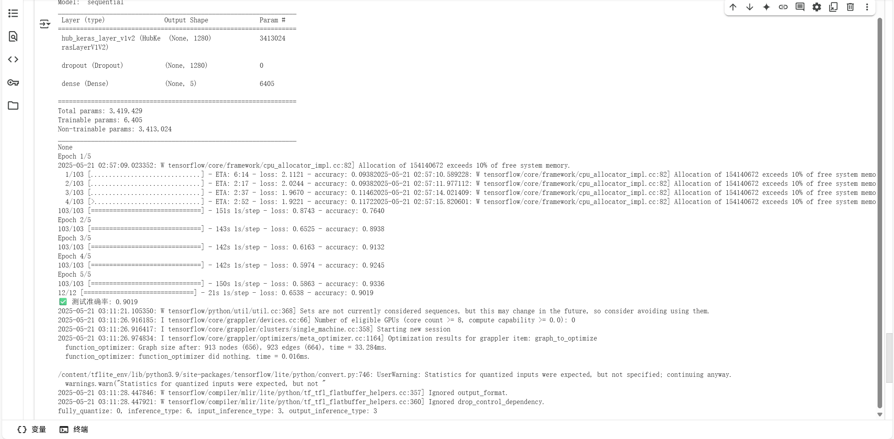

# 使用TensorFlow Lite Model Maker生成图像分类模型


```python
!sudo apt-get update -y
!sudo apt-get install python3.9 python3.9-venv python3.9-distutils curl -y
!python3.9 -m venv /content/tflite_env
!curl -sS https://bootstrap.pypa.io/get-pip.py -o get-pip.py
!/content/tflite_env/bin/python get-pip.py
!/content/tflite_env/bin/pip --version
```



```
! /content/tflite_env/bin/pip install -q \
  tensorflow==2.10.0 \
  keras==2.10.0 \
  numpy==1.23.5 \
  protobuf==3.19.6 \
  tensorflow-hub==0.12.0 \
  tflite-support==0.4.2 \
  tensorflow-datasets==4.8.3 \
  sentencepiece==0.1.99 \
  sounddevice==0.4.5 \
  librosa==0.8.1 \
  flatbuffers==23.5.26 \
  matplotlib==3.5.3 \
  opencv-python==4.8.0.76


```



```
! /content/tflite_env/bin/pip install tflite-model-maker==0.4.2
```



```
! /content/tflite_env/bin/pip install matplotlib_inline IPython
```



```
! /content/tflite_env/bin/python -c "from tflite_model_maker import image_classifier; print('TFLite Model Maker 已成功导入')"
```



```python
# step_train.py
with open('/content/step_train.py', 'w') as f:
    f.write("""
import tensorflow as tf
from tflite_model_maker import image_classifier
from tflite_model_maker.image_classifier import DataLoader

image_path = tf.keras.utils.get_file(
    'flower_photos',
    'https://storage.googleapis.com/download.tensorflow.org/example_images/flower_photos.tgz',
    untar=True)

data = DataLoader.from_folder(image_path)
train_data, test_data = data.split(0.9)

model = image_classifier.create(train_data)
loss, acc = model.evaluate(test_data)
print(f'✅ 测试准确率: {acc:.4f}')
model.export(export_dir='.')
""")
! /content/tflite_env/bin/python /content/step_train.py


```



```
from google.colab import files
files.download('MyFlowerModel.tflite')
```

